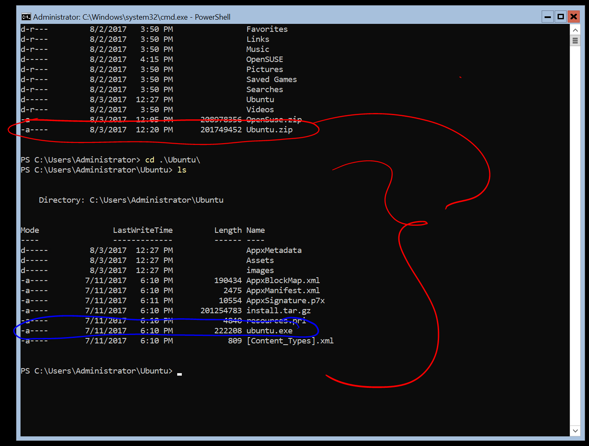

# Windows Server Installation Guide

Windows Subsystem for Linux is available for installation on Windows Server 2019 (version 1709) and later. This guide will walk through the steps of enabling and installing it.

## Enable the Windows Subsystem for Linux

Before you can run Linux distros on Windows, you must enable the "Windows Subsystem for Linux" optional feature and reboot.

Open PowerShell as Administrator and run:
    ```powershell
    Enable-WindowsOptionalFeature -Online -FeatureName Microsoft-Windows-Subsystem-Linux
    ```

Restart your computer when prompted. **This reboot is required** in order to ensure that WSL can initiate a trusted execution environment.

**If you're looking for 100% system call compatibility and faster IO performance, install WSL2!**
> WSL 2 is only available in Windows 10 builds 18917 or higher

## Enable the Virtual Machine Platform feature

Ensure the 'Virtual Machine Platform' optional component is installed. You can do that by running the following command in PowerShell: 

```powershell
dism.exe /online /enable-feature /featurename:Microsoft-Windows-Subsystem-Linux /all /norestart
dism.exe /online /enable-feature /featurename:VirtualMachinePlatform /all /norestart
```

## Download a Linux distro

Follow [these instructions](install-manual.md) to download your favorite Linux distribution.

## Extract and install a Linux distro

Now that you've downloaded a Linux distribution, in order to extract its contents and manually install, follow these steps:

1. Extract the `<distro>.appx` package's contents, using PowerShell:

    ```powershell
    Rename-Item .\Ubuntu.appx .\Ubuntu.zip
    Expand-Archive .\Ubuntu.zip .\Ubuntu
    ```

2. Run the distribution launcher application in the target folder. The launcher is typically named `<distro>.exe` (for example, `ubuntu.exe`).

    

> [!CAUTION]
> **Installation failed with error 0x8007007e**: If you receive this error, then your system doesn't support WSL. Ensure that you're running Windows build 16215 or later. [Check your build](troubleshooting.md#check-your-build-number). Also check to [confirm that WSL is enabled](troubleshooting.md#confirm-wsl-is-enabled) and your computer was restarted after the feature was enabled.  
    
3. Add your distro path to the Windows environment PATH (`C:\Users\Administrator\Ubuntu` in this example), using PowerShell:
        
    ```powershell
    $userenv = [System.Environment]::GetEnvironmentVariable("Path", "User")
    [System.Environment]::SetEnvironmentVariable("PATH", $userenv + ";C:\Users\Administrator\Ubuntu", "User")
    ```
    You can now launch your distribution from any path by typing `<distro>.exe`. For example: `ubuntu.exe`.

Now that it is installed, you must [initialize your new distribution instance](initialize-distro.md) before using it.
                                                                                                                                                                                                                                                                                                                                                                                                                                                                                                                                                                                                                        