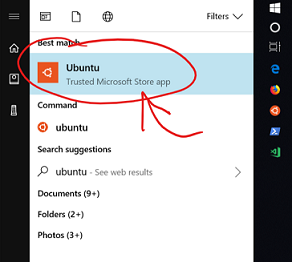
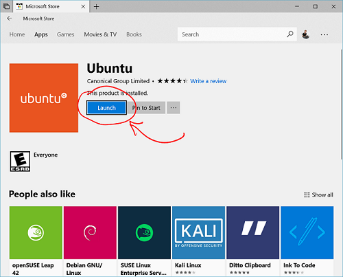

# WSL commands and launch configurations

## Ways to run WSL

There are several ways to run a Linux distribution with WSL once it's [installed](install-win10.md).

1. Open your Linux distribution by visiting the Windows Start menu and typing the name of your installed distributions. For example: "Ubuntu".
2. From Windows Command Prompt or PowerShell, enter the name of your installed distribution. For example: `ubuntu`
3. From Windows Command Prompt or PowerShell, to open your default Linux distribution inside your current command line, enter: `wsl.exe`.
4. From Windows Command Prompt or PowerShell, to open your default Linux distribution inside your current command line, enter:`wsl [command]`.

Which method you should use depends on what you're doing. If you've opened a WSL command line within a Windows Prompt or PowerShell window and want to exit, enter the command: `exit`.

## Launch WSL by distribution

Running a distribution using it's distro-specific application launches that distribution in it's own console window.



It is the same as clicking "Launch" in the Microsoft store.



You can also run the distribution from the command line by running `[distribution].exe`.

The disadvantage of running a distribution from the command line in this way is that it will automatically change your working directory from the current directory to the distribution's home directory.

**Example: (using PowerShell)**

```console
PS C:\Users\sarah> pwd

Path
----
C:\Users\sarah

PS C:\Users\sarah> ubuntu

scooley@scooley-elmer:~$ pwd
/home/scooley
scooley@scooley-elmer:~$ exit
logout

PS C:\Users\sarah>
```

### wsl and wsl [command]

The best way to run WSL from the command line is using `wsl.exe`.

**Example: (using PowerShell)**

```console
PS C:\Users\sarah> pwd

Path
----
C:\Users\sarah

PS C:\Users\sarah> wsl

scooley@scooley-elmer:/mnt/c/Users/sarah$ pwd
/mnt/c/Users/sarah
```

Not only does `wsl` keep the current working directory in place, it lets you run a single command along side Windows commands.

**Example: (using PowerShell)**

```console
PS C:\Users\sarah> Get-Date

Sunday, March 11, 2018 7:54:05 PM

PS C:\Users\sarah> wsl
scooley@scooley-elmer:/mnt/c/Users/sarah$ date
Sun Mar 11 19:56:57 DST 2018
scooley@scooley-elmer:/mnt/c/Users/sarah$ exit
logout

PS C:\Users\sarah> wsl date
Sun Mar 11 19:55:47 DST 2018
```

**Example: (using PowerShell)**

```console
PS C:\Users\sarah> Get-VM

Name            State CPUUsage(%) MemoryAssigned(M) Uptime   Status
----            ----- ----------- ----------------- ------   ------
Server17093     Off   0           0                 00:00:00 Opera...
Ubuntu          Off   0           0                 00:00:00 Opera...
Ubuntu (bionic) Off   0           0                 00:00:00 Opera...
Windows         Off   0           0                 00:00:00 Opera...


PS C:\Users\sarah> Get-VM | wsl grep "Ubuntu"
Ubuntu          Off   0           0                 00:00:00 Opera...
Ubuntu (bionic) Off   0           0                 00:00:00 Opera...
PS C:\Users\sarah>
```

## Managing multiple Linux Distributions

In Windows 10 Version 1903 [and later](ms-settings:windowsupdate), you can use `wsl.exe` to manage your distributions in the Windows Subsystem for Linux (WSL), including listing available distributions, setting a default distribution, and uninstalling distributions.

Each Linux distribution independently manages its own configurations. To see distribution-specific commands, run `[distro.exe] /?`.  For example `ubuntu /?`.

## List distributions

`wsl -l` , `wsl --list`  
Lists available Linux distributions available to WSL.  If a distribution is listed, it's installed and ready to use.

`wsl --list --all`
Lists all distributions, including ones that aren't currently usable.  They may be in the process of installing, uninstalling, or are in a broken state.  

`wsl --list --running`
Lists all distributions that are currently running.

## Set a default distribution

The default WSL distribution is the one that runs when you run `wsl` on a command line.

`wsl -s <DistributionName>`, `wsl --setdefault <DistributionName>`

Sets the default distribution to `<DistributionName>`.

**Example: (using PowerShell)**  
`wsl -s Ubuntu` would set my default distribution to Ubuntu.  Now when I run `wsl npm init` it will run in Ubuntu.  If I run `wsl` it will open an Ubuntu session.

## Unregister and reinstall a distribution

While Linux distributions can be installed through the Microsoft store, they can't be uninstalled through the store.  WSL Config allows distributions to be unregistered/uninstalled.

Unregistering also allows distributions to be reinstalled.

> **Caution:** Once unregistered, all data, settings, and software associated with that distribution will be permanently lost.  Reinstalling from the store will install a clean copy of the distribution.

`wsl --unregister <DistributionName>`  
Unregisters the distribution from WSL so it can be reinstalled or cleaned up.

For example:
`wsl --unregister Ubuntu` would remove Ubuntu from the distributions available in WSL.  When I run `wsl --list` it will not be listed.

To reinstall, find the distribution in the Microsoft store and select "Launch".

## Run as a specific user

`wsl -u <Username>`, `wsl --user <Username>`

Run WSL as the specified user. Please note that user must exist inside of the WSL distribution.

## Run a specific distribution

`wsl -d <DistributionName>`, `wsl --distribution <DistributionName>`

Run a specified distribution of WSL, can be used to send commands to a specific distribution without having to change your default.

## Managing multiple Linux Distributions in earlier Windows versions

In Windows 10 prior to version 1903, the WSL Config (`wslconfig.exe`) command-line tool should be used to manage Linux distributions running on the Windows Subsystem for Linux (WSL).  It lets you list available distributions, set a default distribution, and uninstall distributions.

While WSL Config is helpful for settings that span or coordinate distributions, each Linux distribution independently manages its own configurations.  To see distribution-specific commands, run `[distro.exe] /?`.  For example `ubuntu /?`.

To see all available options for wslconfig, run:  `wslconfig /?`

```console
wslconfig.exe
Performs administrative operations on Windows Subsystem for Linux

Usage:
    /l, /list [/all] - Lists registered distributions.
        /all - Optionally list all distributions, including distributions that
               are currently being installed or uninstalled.
    /s, /setdefault <DistributionName> - Sets the specified distribution as the default.
    /u, /unregister <DistributionName> - Unregisters a distribution.
```

To list distributions, use:

`wslconfig /list`  
Lists available Linux distributions available to WSL.  If a distribution is listed, it's installed and ready to use.

`wslconfig /list /all`  
Lists all distributions, including ones that aren't currently usable.  They may be in the process of installing, uninstalling, or are in a broken state.  

To set a default distribution that runs when you run `wsl` on a command line:

`wslconfig /setdefault <DistributionName>`
Sets the default distribution to `<DistributionName>`.

**Example: (using PowerShell)**  
`wslconfig /setdefault Ubuntu` would set my default distribution to Ubuntu.  Now when I run `wsl npm init` it will run in Ubuntu.  If I run `wsl` it will open an Ubuntu session.

To unregister and reinstall a distribution:

`wslconfig /unregister <DistributionName>`  
Unregisters the distribution from WSL so it can be reinstalled or cleaned up.

For example:
`wslconfig /unregister Ubuntu` would remove Ubuntu from the distributions available in WSL.  When I run `wslconfig /list` it will not be listed.

To reinstall, find the distribution in the Microsoft store and select "Launch".

## Configure launch settings with wslconf

> **Available in Windows Build 17093 and later**

Automatically configure certain functionality in WSL that will be applied every time you launch the subsystem using `wsl.conf`.

Right now, this includes automount options and network configuration.

`wsl.conf` is located in each Linux distribution in `/etc/wsl.conf`. If the file is not there, you can create it yourself. WSL will detect the existence of the file and will read its contents. If the file is missing or malformed (that is, improper markup formatting), WSL will continue to launch as normal.

Here is a sample `wsl.conf` file you could add into your distributions:

```console
# Enable extra metadata options by default
[automount]
enabled = true
root = /windir/
options = "metadata,umask=22,fmask=11"
mountFsTab = false

# Enable DNS – even though these are turned on by default, we'll specify here just to be explicit.
[network]
generateHosts = true
generateResolvConf = true
```

## Configuration Options

In keeping with .ini conventions, keys are declared under a section. 

WSL supports two sections: `automount` and `network`.

### automount

Section: `[automount]`

| key        | value                          | default      | notes                                                                                                                                                                                                                                                                                                                          |
|:-----------|:-------------------------------|:-------------|:-------------------------------------------------------------------------------------------------------------------------------------------------------------------------------------------------------------------------------------------------------------------------------------------------------------------------------|
| enabled    | boolean                        | true         | `true` causes fixed drives (i.e `C:/` or `D:/`) to be automatically mounted with DrvFs under `/mnt`.  `false` means drives won't be mounted automatically, but you could still mount them manually or via `fstab`.                                                                                                             |
| mountFsTab | boolean                        | true         | `true` sets `/etc/fstab` to be processed on WSL start. /etc/fstab is a file where you can declare other filesystems, like an SMB share. Thus, you can mount these filesystems automatically in WSL on start up.                                                                                                                |
| root       | String                         | `/mnt/`      | Sets the directory where fixed drives will be automatically mounted. For example, if you have a directory in WSL at `/windir/` and you specify that as the root, you would expect to see your fixed drives mounted at `/windir/c`                                                                                              |
| options    | comma-separated list of values | empty string | This value is appended to the default DrvFs mount options string. **Only DrvFs-specific options can be specified.** Options that the mount binary would normally parse into a flag are not supported. If you want to explicitly specify those options, you must include every drive for which you want to do so in /etc/fstab. |

By default, WSL sets the uid and gid to the value of the default user (in Ubuntu distro, the default user is created with uid=1000,gid=1000). If the user specifies a gid or uid option explicitly via this key, the associated value will be overwritten. Otherwise, the default value will always be appended.

**Note:** These options are applied as the mount options for all automatically mounted drives. To change the options for a specific drive only, use /etc/fstab instead.

### Mount options

Setting different mount options for Windows drives (DrvFs) can control how file permissions are calculated for Windows files. The following options are available:

| Key | Description | Default |
|:----|:----|:----|
|uid| The User ID used for the owner of all files | The default User ID of your WSL distro (On first installation this defaults to 1000)
|gid| The Group ID used for the owner of all files | The default group ID of your WSL distro (On first installation this defaults to 1000)
|umask | An octal mask of permissions to exclude for all files and directories | 000
|fmask | An octal mask of permissions to exclude for all files | 000
|dmask | An octal mask of permissions to exclude for all directories | 000

**Note:** The permission masks are put through a logical OR operation before being applied to files or directories. 

### network

Section label: `[network]`

| key | value | default | notes|
|:----|:----|:----|:----|
| generateHosts | boolean | `true` | `true` sets WSL to generate `/etc/hosts`. The `hosts` file contains a static map of hostnames corresponding IP address. |
| generateResolvConf | boolean | `true` | `true` set WSL to generate `/etc/resolv.conf`. The `resolv.conf` contains a DNS list that are capable of resolving a given hostname to its IP address. | 

### interop

Section label: `[interop]`

These options are available in Insider Build 17713 and later.

| key | value | default | notes|
|:----|:----|:----|:----|
| enabled | boolean | `true` | Setting this key will determine whether WSL will support launching Windows processes. |
| appendWindowsPath | boolean | `true` | Setting this key will determine whether WSL will add Windows path elements to the $PATH environment variable. |
