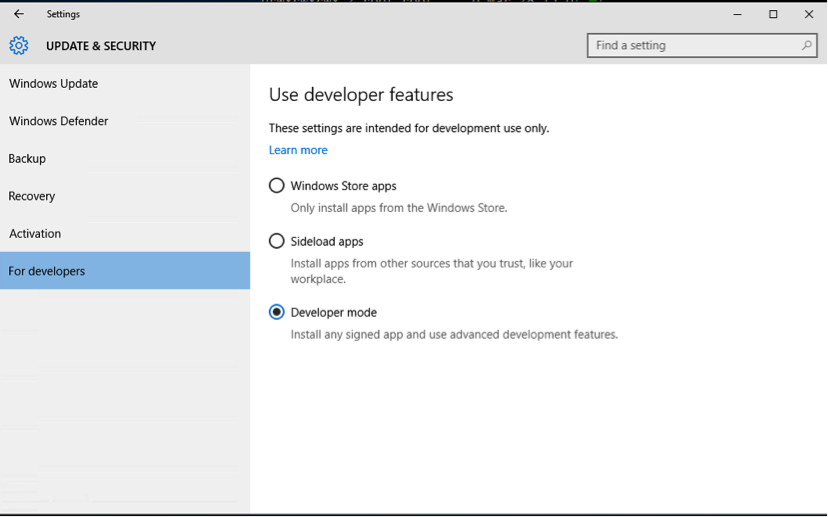

# Installation Guide

> **Important note**  
	This is the first release of Bash on Windows and it is branded "beta" deliberately - it's not yet complete! You should expect many things to work and for some things to fail! We greatly appreciate you using Bash on Windows and helping us identify the issues we need to fix in order to deliver a great experience.

##Prerequisites
1. Windows 10 Anniversary Update - build 14393<br/>
      Available as of 8/2/2016
2. x64-based processor

1. Your PC must have an AMD/Intel x64 compatible CPU
2. You must be a member of the (free) [Windows Insider Program](http://insider.windows.com/) (Preferably Fast-Ring)
3. Your PC must be running a 64-bit version of **Windows 10 Anniversary Update build 14316 or later**
    
> To find your PC's CPU architecture and Windows version/build number, open 
> **Settings**>**System**>**About**. 
> Look for the **OS Build** and **System Type** fields.  

 

If your build is below 14393, try checking for updates.


## Installation
In order to run Bash on Windows, you will need to manually:
1. Turn-on Developer Mode
2. Enable the "Windows Subsystem for Linux (beta)" feature via the GUI or the command-line:

### Turn on Developer Mode
1. Open Settings -> Update and Security -> For developers
2. Select the Developer Mode radio button  
  

### Enable the Windows Subsystem for Linux feature (GUI)
1. From Start, search for "Turn Windows features on or off" (type 'turn')
2. Select **Windows Subsystem for Linux (beta)**  
  
  
3. Click OK

### Enable the Windows Subsystem for Linux feature (command-line)

Open a PowerShell prompt as administrator and run:

```PowerShell
Enable-WindowsOptionalFeature -Online -FeatureName Microsoft-Windows-Subsystem-Linux
```

### After enabling Windows Subsystem for Linux
**Restart your computer when prompted**

> It is important that you **DO restart when prompted** as some of the infrastructure which Bash on Windows requires can only be loaded during Windows' boot-up sequence.

### Run Bash on Windows
1. Open a command prompt
1. Run `bash` 
  
  
  
After you have accepted the License, the Ubuntu user-mode image will be downloaded and a "Bash on Ubuntu on Windows" shortcut will be added to your start menu.

To launch Bash on Windows, either run `bash` at a cmd/PowerShell command-prompt, or use the start menu shortcut.

> **Note**: The first time you install Bash on Windows, you will be prompted to create a UNIX username and password - this can be different from, and has no relationship to, your Windows username and password.
> More information on the UNIX username and password can be found [here](https://msdn.microsoft.com/en-us/commandline/wsl/user_support).
