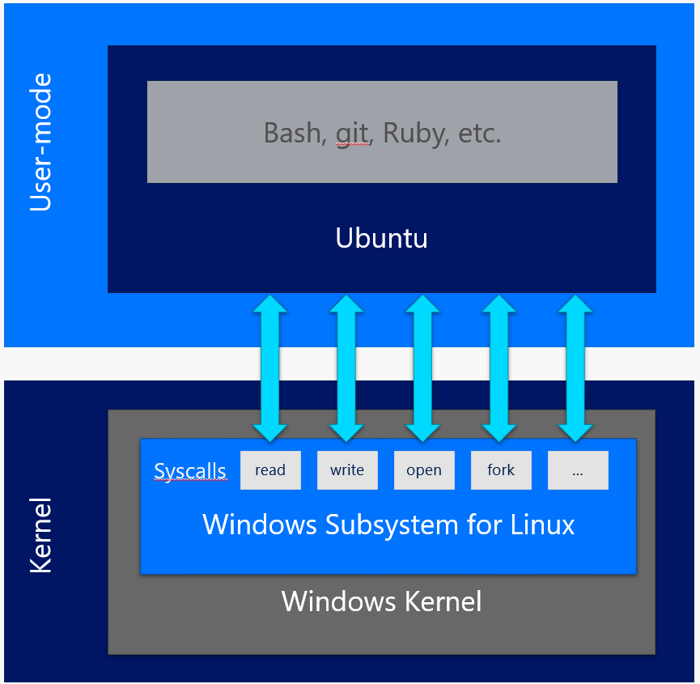

# Architectural Reference

This scenario is comprised of two main components:

1.	**Ubuntu on Windows**  
  Genuine Ubuntu user-mode binaries provided by Canonical. 

2.	**Window Subsystem for Linux (WSL)**  
  This infrastructure supports unmodified Ubuntu binaries by exposing Linux-compatible kernel interfaces.  It includes Microsoft components that are responsible for handling Linux system call requests in coordination with the Windows NT kernel.  
  This subsystem was developed by Microsoft and contains no Linux code.

## LXSS Manager service 
The LXSS Manager service is a broker to the LX subsystem driver and is the way that windows applications go about launching LX binaries.  When a NT process (for example bash.exe) wants to launch the LX binary that request goes through the LXSS Manager service.  There is minimal per-user state that keeps track of if the user currently has the Ubuntu bits installed.  The service is also used for synchronization around uninstall and uninstall, allowing only one process to do those operations at a time and block LX binaries from being launched while the operation is pending.

All LX processes launched by a particular user go into an LX Instance.  Think of an instance as just a data structure that keeps track of all LX processes, threads, and runtime state.  The first time an NT process requests launching a LX binary an instance is created.  

Once the last NT client goes away the instance is terminated. This includes any processes that were launched inside of the instance including daemons (for example the git credential cacher).

## Syscalls
The Windows Subsystem for Linux executes unmodified Linux Elf binaries by exposing Linux-compatible kernel interfaces.  One of the kernel interfaces that it exposes are system calls (syscalls).

A syscall is a service provided by the kernel that can be called from user mode.  Both the Linux kernel and Windows NT kernel expose syscalls to user mode, but they have different semantics and for the most part are not directly compatible.  For example, the Linux kernel has a few hundred syscalls including things like `fork`, `open`, and `kill` while the Windows NT kernel has several hundred syscalls include things `NtCreateProcess`, `NtOpenFile`, and `NtTermianteProcess`.

The Windows Subsystem for Linux includes kernel mode drivers (`lxss.sys` and `lxcore.sys`) that are responsible for handling Linux system call requests in coordination with the Windows NT kernel.  The drivers do not contain code from the Linux kernel but instead a clean room implementation of Linux-compatible kernel interfaces.  On native Linux, when a syscall is made from a user mode executable it is handled by the Linux kernel.  On the Windows Subsystem for Linux, when a syscall is made from the same executable the Windows NT kernel forwards the request to `lxcore.sys`.  Where possible, `lxcore.sys` translates the Linux syscall to the equivalent Windows functionality to do the heavy lifting.  Where there is no reasonable mapping from Linux to Windows the kernel mode driver must service the request directly.

The Linux `fork` syscall is interesting to discuss because there is no direct equivalent documented for Windows.  At a high level, fork simply creates a copy of the current process.  When a fork system call is made on the Windows Subsystem for Linux, `lxcore.sys` does some initial work to prepare for copying the process, calls internal Windows NT kernel APIs to create the process with the correct semantics, and completes copying additional data for the new process.
